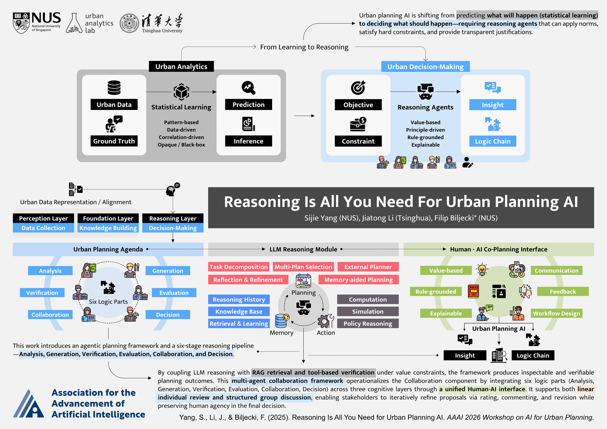

# Reasoning Is All You Need for Urban Planning AI

AI has been strong at urban **analysis** (learning from data to predict). This work argues the next step is AI-assisted **decision-making**—recommending sites, allocating resources, and weighing trade-offs with transparent reasoning about constraints and stakeholder values. Recent methods (chain-of-thought, ReAct, multi-agent collaboration) make that direction realistic.

We compare **statistical learning** with **reasoning agents**: data-driven models excel at prediction but are limited for normative choices, hard regulatory guarantees, and explicit justification. We introduce the **Agentic Urban Planning AI Framework**—three cognitive layers (Perception, Foundation, Reasoning) and six logic components (Analysis, Generation, Verification, Evaluation, Collaboration, Decision), with a human–AI collaboration design oriented toward value-based, rule-grounded, explainable planning support.

Presented at [AI4UP 2026](https://ai-for-urban-planning.github.io/AAAI26-workshop/) (The 2nd Workshop on AI for Urban Planning), co-located with AAAI 2026.



**Authors:** [Sijie Yang](https://sijie-yang.com), [Jiatong Li](https://ual.sg/author/jiatong-li/), [Filip Biljecki](https://filipbiljecki.com) · [Urban Analytics Lab](https://ual.sg), NUS

- **Paper:** [arXiv:2511.05375](https://arxiv.org/abs/2511.05375)
- **Poster (PDF):** [`docs/poster.pdf`](docs/poster.pdf)
- **Site:** [`docs/`](docs/) · GitHub Pages: branch **main**, folder **`/docs`**

## Citation

```bibtex
@inproceedings{yang2026reasoning4up,
  title        = {Reasoning Is All You Need for Urban Planning {AI}},
  author       = {Yang, Sijie and Li, Jiatong and Biljecki, Filip},
  booktitle    = {Proceedings of the 2nd Workshop on AI for Urban Planning},
  year         = {2026},
  organization = {Association for the Advancement of Artificial Intelligence},
  note         = {AI4UP @ AAAI 2026. Position paper},
  url          = {https://ai-for-urban-planning.github.io/AAAI26-workshop/}
}
```
